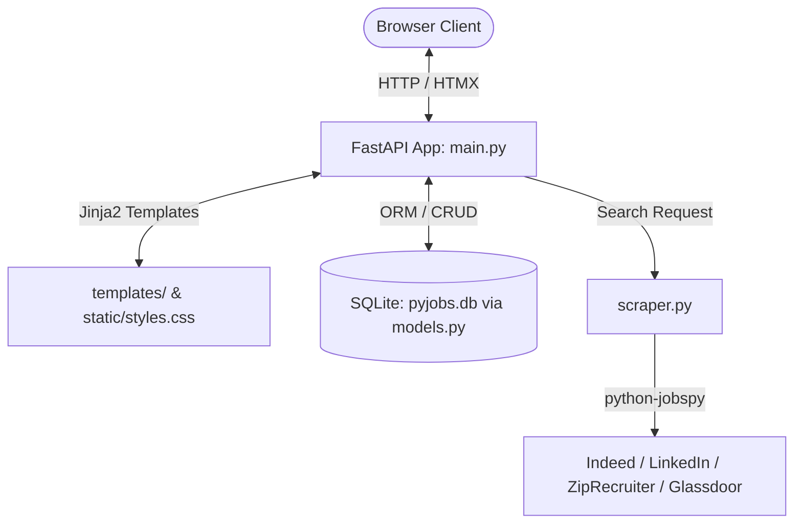

# PyJobs: Project Overview & Workspace Blueprint

## 1. Totality Review of PyJobs

### 1.1 Architecture & Stack Overview
PyJobs is a lightweight, full-stack Python web application designed for intelligent job scraping, curation, and management:

* **Backend Framework**: **FastAPI** (`>=0.136.0`) with **Uvicorn** (`>=0.44.0`), running on Python 3.14 managed by **uv** (`0.11.21`).
* **Database & ORM**: **SQLite** (`pyjobs.db`) managed via **SQLAlchemy** (`>=2.0.49`).
* **Frontend**: Server-rendered **Jinja2** templates (`templates/`) powered by **HTMX** (`1.9.10`) for dynamic, SPA-like partial DOM updates without full page reloads.
* **Styling**: Custom modern Vanilla CSS (`static/styles.css`) featuring a sleek dark-mode glassmorphic design system.
* **Scraping Engine**: `scraper.py` wraps **`python-jobspy`** (`>=1.1.82`) to aggregate postings across Indeed, LinkedIn, ZipRecruiter, and Glassdoor, returning pandas DataFrames converted to structured dictionaries.

---

### 1.2 Codebase Anatomy & Flow

1. **Entrypoint & Routing (`main.py`)**:
   * `GET /`: Serves dashboard (`index.html`) with stored user preferences.
   * `POST /preferences`: Persists search keywords, location, and fields in SQLite; returns updated form partial (`preferences_form.html`).
   * `POST /search`: Triggers `fetch_jobs()`, deduplicates against existing records via `job_id`, inserts newly found jobs, and returns `job_results.html`.
   * `GET /job/{id}` & `DELETE /job/{id}`: View details or remove job cards from the UI via HTMX DOM replacement.
2. **Data Models (`models.py`)**:
   * `UserPreference`: Stores target position keywords, location, and industry fields.
   * `SavedJob`: Stores scraped metadata (title, company, salary source, posting date, original URL, description).
3. **Database Connection (`database.py`)**:
   * Standard SQLite connection with thread checking disabled for FastAPI compatibility.

---

### 1.3 Baseline Diagnostic Audit (Current Issues Found)

| Tool | Status | Details |
| :--- | :--- | :--- |
| **`ruff check .`** | **1 error** | Unused import `Boolean` in `models.py:1`. |
| **`ty check .`** | **5 diagnostics** | `models.py` uses legacy SQLAlchemy 1.x `Column(String)` syntax rather than SQLAlchemy 2.0 `Mapped[...] = mapped_column(...)`. In `main.py:53-75`, `ty` detects invalid assignments and type mismatches (`ColumnElement[str]` passed where `str` is expected). |
| **`biome check`** | **4 errors + formatting** | Missing `type="button"` attributes on buttons in `templates/index.html`, `job_detail.html`, and `job_results.html`; indentation formatting in `styles.css`. |
| **`pytest`** | **0 tests** | No automated tests exist currently. |
| **Git Branch** | **master vs main** | Current branch is `master`, whereas our workflow will standardize on `main`. |

---

## 2. Workspace Setup for Code Revision & Revamp

### 2.1 Verification Toolchain Configuration
1. **Python Linting & Formatting (`ruff`)**:
   * Configured in `pyproject.toml` with rule selection (`E`, `F`, `I`, `B`, `UP`).
   * Execution: `ruff check .` and `ruff format --check .` (auto-fix with `--fix`).
2. **Python Static Type Checking (`ty`)**:
   * Astral's Rust-based type checker installed via `uv tool install ty`.
   * Modernize `models.py` to SQLAlchemy 2.0 `Mapped[T]` syntax to resolve all static type discrepancies.
   * Execution: `ty check .` (or `ty check --watch` during active development).
3. **Frontend Linting & Formatting (`biome`)**:
   * Configured via `biome.json` supporting CSS, HTML, and JS formatting and a11y linting.
   * Execution: `npx @biomejs/biome check static/ templates/` (or `--write` for auto-fixing).

---

### 2.2 Git Workflow & Automated Pre-Commit Checks

1. **Branch Standardization**:
   * Rename default branch to `main`: `git branch -M main`.
   * Feature-branch convention: `feat/<name>`, `fix/<name>`, `refactor/<name>`.
2. **Unified Verification Runner (`scripts/check.ps1`)**:
   * Automatically detects modified files (or checks the whole workspace).
   * Runs `ruff` and `ty` for Python code.
   * Runs `biome` for `.css`, `.html`, and `.js` code.
   * Runs `pytest` test suite.
3. **Git Pre-Commit Hook**:
   * Automated `.git/hooks/pre-commit` script to prevent committing code that fails linter, type-check, or test standards.

---

## 3. High-Efficiency Enhancements

1. **Asynchronous / Background Scraping Architecture**:
   * Migrate synchronous scraping in route handlers to FastAPI `BackgroundTasks` or async workers so the UI remains instantaneous and responsive without server blocking.
2. **Unit & Integration Test Suite with Mocked Scrapers**:
   * Add `pytest` test cases using FastAPI `TestClient`, mocking `fetch_jobs` so tests run in sub-second time without external network calls.
3. **SQLAlchemy 2.0 Typing Modernization**:
   * Migrate `models.py` to `Mapped[str] = mapped_column(...)` for full static typing and autocompletion.
4. **Database Migrations (Alembic)**:
   * Introduce Alembic to track database schema migrations systematically without dropping `pyjobs.db`.
5. **Centralized Settings & Configuration**:
   * Manage environment variables (`DATABASE_URL`, scraper timeouts, search defaults) via Pydantic `BaseSettings` and `.env`.
