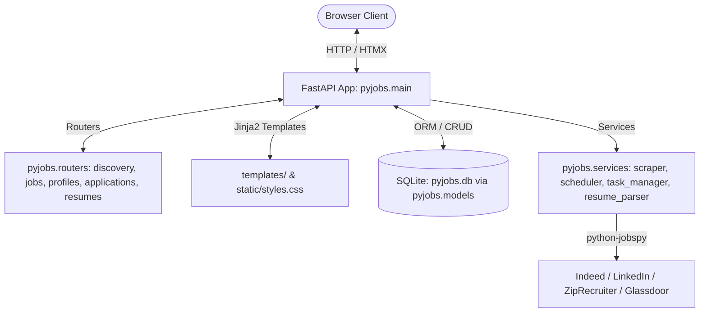

# PyJobs: Project Overview & Workspace Blueprint

## 1. Totality Review of PyJobs (v0.2.0)

### 1.1 Architecture & Stack Overview
PyJobs is a lightweight, full-stack Python web application designed for intelligent job scraping, curation, and management:

* **Backend Framework**: **FastAPI** (`>=0.136.0`) with **Uvicorn** (`>=0.44.0`), running on Python 3.14 managed by **uv** (`0.11.21`).
* **Package Architecture**: Organized under `pyjobs/` with modular controllers (`pyjobs.routers`), services (`pyjobs.services`), centralized dependencies (`pyjobs.dependencies`), and declarative ORM layer (`pyjobs.database`, `pyjobs.models`).
* **Database & ORM**: **SQLite** (`pyjobs.db`) managed via **SQLAlchemy** (`>=2.0.49`) with declarative `Mapped[T]` annotations.
* **Frontend**: Server-rendered **Jinja2** templates (`templates/`) powered by **HTMX** (`1.9.10`) for dynamic, SPA-like partial DOM updates without full page reloads.
* **Styling**: Custom modern Vanilla CSS (`static/styles.css`) featuring a sleek dark-mode glassmorphic design system.
* **Scraping & Ingestion**: `pyjobs.services.scraper` wraps **`python-jobspy`** (`>=1.1.82`) to aggregate postings across Indeed, LinkedIn, ZipRecruiter, and Glassdoor, returning structured dictionaries with automated salary categorization and seniority classification.
* **Resume Management**: `pyjobs.services.resume_parser` handles text extraction via PyMuPDF (`fitz`), `.docx` parsing via `python-docx`, automatic Word-to-PDF compilation via `docx2pdf` and pure PyMuPDF fallback, dynamic retrieval filename templating, and semantic match scoring.
* **Background Processing & Scheduling**: `pyjobs.services.task_manager` coordinates non-blocking worker threads with real-time SSE progress indicators; `pyjobs.services.scheduler` handles automated background recurring scans.

---

### 1.2 Codebase Anatomy & Flow

#### Package Structure (`pyjobs/`)
* **`pyjobs.main`**: Slim application orchestrator (~50 lines) initializing FastAPI `v0.2.0`, lifespan scheduler, static asset mounting, and router registration.
* **`pyjobs.routers`**:
  * `discovery.py`: Discovery feed (`GET /`), preferences (`POST /preferences`), quick search (`POST /search`), and scrape endpoints (`POST /scrape/start`, `GET /scrape/status/{task_id}`).
  * `jobs.py`: Filter jobs (`GET /jobs/filter`), multi-format export (`GET /jobs/export`), staleness management, job drawer, hide/unhide, and 1-click tracking (`POST /job/{id}/track`).
  * `profiles.py`: Search profiles management (`GET /profiles/sidebar`, `POST /profiles`, `POST /profiles/{id}`, `DELETE /profiles/{id}`).
  * `applications.py`: Applications dashboard (Kanban & Table), detail command center, contacts CRUD, activity timeline, and certified unemployment reporting.
  * `resumes.py`: Resumes dashboard, versions management, in-browser PDF viewing, templated file downloads, and candidate settings.
* **`pyjobs.services`**:
  * `scraper.py`: JobSpy scraping engine, location parsing, deduplication, seniority classification, and staleness evaluation.
  * `scheduler.py`: Background recurring scan scheduler loop.
  * `task_manager.py`: In-memory background task tracking and worker thread coordination.
  * `resume_parser.py`: PDF/DOCX text extraction, Word compilation, scoring, and filename templating.
* **`pyjobs.database`**: SQLite engine, DeclarativeBase, session factory, and automatic incremental schema migrations.
* **`pyjobs.models`**: SQLAlchemy 2.0 declarative models (`UserPreference`, `SearchProfile`, `JobSearchProfile`, `SavedJob`, `JobApplication`, `ApplicationContact`, `ApplicationActivity`, `Resume`, `ResumeVersion`).
* **`pyjobs.dependencies`**: Dependency injection (`get_db`, `templates`), path resolvers (`get_upload_dir`), and shared query helpers.
* **`pyjobs.launcher`**: Network-enabled server launcher with local IP detection and browser spawning, wrapped by root `run.py`.

---

### 1.3 Quality Gate & Test Status

| Tool | Status | Details |
| :--- | :--- | :--- |
| **`ruff check .`** | **0 errors** | Clean across all Python modules. |
| **`ruff format --check .`** | **0 errors** | 100% formatted. |
| **`ty check .`** | **0 diagnostics** | Full SQLAlchemy 2.0 `Mapped[T]` and TypedDict type safety. |
| **`biome check`** | **0 errors** | Biome-compliant HTML, CSS, and JS with explicit `type="button"` attributes. |
| **`pytest`** | **80 passing** | Sub-second hermetic test suite across `test_applications.py`, `test_curation.py`, `test_hooks.py`, `test_launcher.py`, `test_resumes.py`, `test_routes.py`, `test_scheduler.py`, `test_scraper.py`, `test_search_profiles.py`. |
| **Git Branches** | **Standardized** | Feature workflow branching from `main` / `dev`. |

---

## 2. Workspace Setup for Code Revision & Revamp

### 2.1 Verification Toolchain Configuration
1. **Python Linting & Formatting (`ruff`)**:
   * Configured in `pyproject.toml` with rule selection (`E`, `F`, `I`, `B`, `UP`) and `known-first-party = ["pyjobs"]`.
   * Execution: `ruff check .` and `ruff format --check .` (auto-fix with `--fix`).
2. **Python Static Type Checking (`ty`)**:
   * Astral's Rust-based type checker installed via `uv tool install ty`.
   * Execution: `ty check .`.
3. **Frontend Linting & Formatting (`biome`)**:
   * Configured via `biome.json` supporting CSS, HTML, and JS formatting and a11y linting.
   * Execution: `npx @biomejs/biome check static/ templates/` (or `--write` for auto-fixing).
4. **Unified Verification Runner (`scripts/check.ps1`)**:
   * Runs all linters, type-checkers, formatters, and pytest hermetic test suite in one command.
